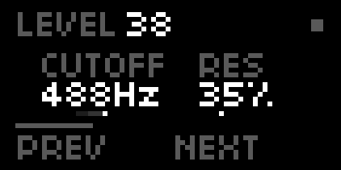
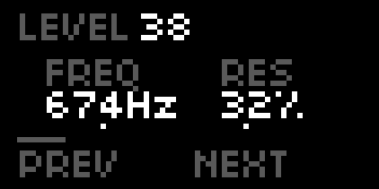
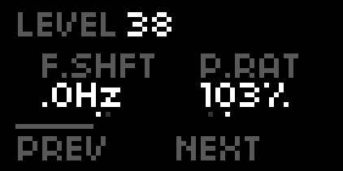

---
---

# Bob

Lowpass filter with LFO/envelope follower modulation

## Operation

- `ENC1` adjusts main output level.
- `ENC2` changes first parameter displayed on screen.
- `ENC3` changes second parameter displayed on screen.
- `KEY2` go to previous page.
- `KEY3` go to next page.
- `ARC` first two encoders act as norns `ENC2` and `ENC3`.

---
---

# Moln

Polyphonic subtractive synthesizer

## Features

- 2 square oscillators per voice with variable pulse width and pulse width modulation.
- Resonant lowpass filter
- ADSR envelope

## Operation

- `ENC1` adjusts main output level.
- `ENC2` changes first parameter displayed on screen.
- `ENC3` changes second parameter displayed on screen.
- `KEY2` go to previous page.
- `KEY3` go to next page.
- `ARC` first two encoders act as norns `ENC2` and `ENC3`.
- `MIDI` device plays notes.
- `GRID` plays notes too.

## Parameters

- `FREQ` / `Filter Frequency` - `10Hz`...`8kHz`. Lowpass filter cutoff frequency.
- `RES` / `Filter Resonance` - `0`...`100%`. Lowpass filter cutoff resonance.
- `A.RNG` / `Osc A Range` - `-2`..`+2`. Octave range.
- `B.RNG` / `Osc B Range` - `-2`..`+2`. Octave range.
- `A.PW` / `Osc A Pulse Width` - `0`..`100%`.
- `B.PW` / `Osc B Pulse Width` - `0`..`100%`.
- `DETUN` / `Osc Detune` - `0`...`100%`. Detunes the two oscillators.
- `LFO` / `PWM Rate` - `0.01Hz`..`50Hz`. Pulse Width Modulation rate.
- `PWM` / `PWM Depth` - `0`...`100%`. Pulse Width Modulation depth.
- `E>FIL` / `Env > Filter Frequency` - `-100%`...`100%`. Lowpass filter envelope modulation.
- `E.ATK` / `Env Attack` - `0.1ms`...`2s`. ADSR envelope attack time.
- `E.DEC` / `Env Decay` - `0.1ms`...`8s`. ADSR envelope decay time.
- `E.SUS` / `Env Sustain` - `0`...`100%`. ADSR envelope sustain level.
- `E.REL` / `Env Release` - `0.1ms`...`8s`. ADSR envelope release time.

Parameters are also available in the global parameters list.

---
---

# Rymd

Cross-feedback delay with damping and delay line modulation

## Operation

- `ENC1` adjusts main output level.
- `ENC2` changes first parameter displayed on screen.
- `ENC3` changes second parameter displayed on screen.
- `KEY2` go to previous page.
- `KEY3` go to next page.
- `ARC` first two encoders act as norns `ENC2` and `ENC3`.

---
---

# Skev

Pitch and frequency shifter with modulation

## Operation

- `ENC1` adjusts main output level.
- `ENC2` changes first parameter displayed on screen.
- `ENC3` changes second parameter displayed on screen.
- `KEY2` go to previous page.
- `KEY3` go to next page.
- `ARC` first two encoders act as norns `ENC2` and `ENC3`.
